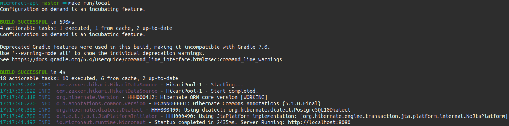

# micronaut-api
Micronaut Rest API Playground With Java 11, GraalVM, Docker, JPA, Gradle6, JUnit5, and More Features

## Micronaut
Micronaut is a modern, JVM-based, full stack microservices framework designed for building modular, easily testable microservice applications.

Micronaut is developed by the creators of the Grails framework and takes inspiration from lessons learnt over the years building real-world applications from monoliths to microservices using Spring, Spring Boot and Grails.

Micronaut aims to provide all the tools necessary to build full-featured microservice applications, including:

- Dependency Injection and Inversion of Control (IoC)
- Sensible Defaults and Auto-Configuration
- Configuration and Configuration Sharing
- Service Discovery
- HTTP Routing
- HTTP Client with client-side load-balancing

At the same time Micronaut aims to avoid the downsides of frameworks like Spring, Spring Boot and Grails by providing:
- Fast startup time
- Reduced memory footprint
- Minimal use of reflection
- Minimal use of proxies
- Easy unit testing

Source: https://docs.micronaut.io/latest/guide/index.html 

## Application Checklist

- [x] Micronaut 1.3.4
- [x] Java 11
- [x] Github Actions CI
- [x] Postgres
- [x] Graal VM 11
- [x] Docker
- [x] Docker-Compose
- [x] Docker Swarm
- [x] Sentry
- [x] Prometheus
- [x] Swagger
- [x] Unit-Tests
- [x] Integration-Tests

## Build and Startup


## Setup
Download and configure GraalVM 20.x (Embbeded Java11) for your operacional system https://github.com/graalvm/graalvm-ce-builds/releases

## How To Build
Build and install dependencies

```bash
make install
```

Build, install dependencies and run unit-tests

```bash
make build
```

## How To Run

Run docker-compose
```bash
make run
```

Run docker-compose structure only (db)
```bash
make run/docker-compose-structure
```

Run docker (db should be running)
```bash
make run/docker
```

Run local (db should be running)
```bash
make run/local
```

## How To Run Tests

Run all tests
```bash
make test
```

Run unit tests
```bash
make test/unit
```

Run integration tests
```bash
make test/integration
```

## Swagger
http://localhost:8080/swagger-ui/

## Prometheus Metrics
To learn more about Prometheus, visit https://prometheus.io
To access local metrics, access:
http://localhost:8080/prometheus

## Sentry
To learn more about Sentry, visit https://sentry.io
Create a free Sentry account
Passing as application arguments or environment variable SENTRY_DSN
```bash
export SENTRY_DSN=YOUR-SENTRY-DSN
```

## Docker Swarm
To learn more about Docker Swarm, visit https://prometheus.io
This project is configured to run with docker swarm. [First configure docker swarm](https://www.dataquest.io/blog/install-and-configure-docker-swarm-on-ubuntu)
Create Docker Swarm node
```bash
docker swarm init --advertise-addr [your-localhost-ip-v4]
```

Create and initialize stack
```bash
docker stack deploy --compose-file="docker-compose.yml" micronaut-api
```
Will running application in docker containers management by Docker Swarm.

Docker Swarm configuration is defined in `deploy` configuration in docker-compose.yml file

## Contributors
Just don't commit directly on master, push a branch and Pull Request.
